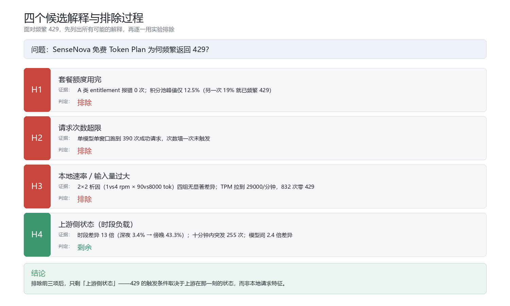

# SenseNova 429 限流机制的排除法研究

**用两次受控实验排除四种候选解释**

**版本 v2.0** · 2026-10-04 · 作者：[Corvin Yu](https://github.com/CorvinYu) · 协议：[CC BY 4.0](LICENSE)

- 实验一：2026-10-03 白天（北京 09:03–16:06），963 次请求
- 实验二：北京 2026-10-04 凌晨（01:55–09:25），2080 次请求
- 生产数据：近 7 天 2820 条真实请求记录
- **合计 3043 次受控请求 + 2820 条观测记录**

---

## 一句话结论

> **429 不是套餐额度问题，不是请求次数问题，也不是本地请求速率或输入长度问题——触发条件取决于上游在那一刻的状态。**

---

## 研究思路：排除法

面对频繁 429，先列出所有可能的解释，再逐一用实验排除：

| 假设 | 内容 | 判定 | 排除依据 |
|---|---|---|---|
| **H1** | 套餐额度用完 | ❌ 排除 | A 类额度墙报错 0 次；积分池峰值仅 12.5% |
| **H2** | 请求次数超限 | ❌ 排除 | 单模型单窗口跑到 390 次成功请求，次数墙未触发 |
| **H3** | 本地速率 / 输入量过大 | ❌ 排除 | 2×2 析因四组无显著差异；TPM 达 29,000/分钟仍零 429 |
| **H4** | 上游侧状态（时段负载） | ✅ 唯一剩余 | 时段差异 13 倍；突发性；模型间 2.4 倍差异 |



---

## 两类 429 的分工（理解本研究的关键）

SenseNova 返回的 429 按报文分两类，它们在研究中承担**不同角色**：

| 类别 | 报文 | 性质 | 角色 |
|---|---|---|---|
| **A 类** | `token plan entitlement exhausted` | 权益/额度墙 | **阴性对照**——用来排除 H1、H2 |
| **B 类** | `inference exceeds tpm/rpm limit` 等 | 频率闸 | **被测现象**——需要解释的是它 |

**A 类全程 0 次出现**（3043 次请求），这个"零结果"本身就是排除额度解释的关键证据。

> 换句话说：A 类不是"另一类要测量的 429"，而是实验里的**空白对照**。

---

## 核心数据

### 实验二：2×2 析因（最关键的受控检验）

| 组 | 请求率 | 输入长度 | 请求数 | B 类 429 | B 类率 |
|---|---|---|---|---|---|
| A1 | 1/min | 90 tok | 208 | 1 | 0.48% |
| A2 | 1/min | 8000 tok | 208 | 1 | 0.48% |
| A3 | 4/min | 90 tok | 832 | 0 | 0.00% |
| A4 | 4/min | 8000 tok | 832 | 0 | 0.00% |

**统计检验**（Fisher，Bonferroni α=0.0125）：

| 对比 | Δ | p 值 | 结论 |
|---|---|---|---|
| 固定请求率，变输入规模 | 0.0 pp | 1.0000 | 不显著 |
| 固定输入规模，变请求率 | −0.48 pp | 0.2000 | 不显著 |
| 高请求率下，变输入规模 | 0.0 pp | 1.0000 | 不显著 |

**A4 组实测 TPM 达 29,148/分钟，832 次请求零 B 类 429。**

### 生产观测：时段分布（单模型口径）

| 时段（北京） | B 类率 | 样本 |
|---|---|---|
| 深夜 01–04 | **3.4%** | n=206 |
| 清晨 05–08 | 20.2% | n=203 |
| 白天 09–16 | 25.4% | n=197 |
| **傍晚 17–23** | **43.3%** | n=922 |

### 突发性

某日傍晚 18 时逐 10 分钟：`28 → 255 → 33 → 1`（十分钟内爆发 255 次后骤降）

---

## 实用含义

| 做法 | 有效性 | 依据 |
|---|---|---|
| 缩短上下文以降低 TPM | ❌ 无效 | H3 已排除 |
| 降低请求频率 | ❌ 效果有限 | H3 已排除 |
| 盯积分池预警 | ❌ 无效 | H1 已排除 |
| **避开高峰时段（尤其傍晚）** | ✅ 有效 | 时段差异 13 倍 |
| **多账号/多节点故障转移** | ✅ 有效 | 模型差异 2.4 倍 + 上游突发 |
| **按文案区分两类 429 再定退避** | ✅ 有效 | 见下节 |

---

## 三个容易踩的坑（方法学发现）

### 1. 429 分类不能只看错误码

同一个频率闸至少返回 **7 种错误码**，其中 `code 8`（通常被认为是额度墙标志）有一条对应的报文是 `rpm exhausted`，属于频率限制。

按错误码分类的实现，会把仍可用的模型误判为额度耗尽、错误停用 5 小时。**可靠判据只有响应文案。**

### 2. 生产日志的 token 字段不能用于限流归因

按"上游返回的 token 数"分组统计，会得到：

```
大输入（>10k token）  429 率 0.0%
无 token 记录（null） 429 率 90%+
```

看似"token 越多越安全"，实为**因果倒置**——请求失败时上游不返回 usage，token 必然为 NULL。

### 3. "什么都没发生"的对照组也有价值

本研究最初把 A 类报错当作待测现象，后来意识到它的正确角色是**阴性对照**。这个零结果比任何阳性观测都更干净地排除了一个候选解释。

---

## 目录结构

```
.
├── REPORT.md                    ← 完整报告（建议先读）
├── README.md                    ← 本文件
├── LICENSE                      ← CC BY 4.0
├── charts/                      ← 5 张图表
│   ├── chart0-elimination-logic.png    排除逻辑图
│   ├── chart1-hourly-peak-valley.png   时段峰谷
│   ├── chart2-segment-v4flash.png      单模型分段对比
│   ├── chart3-burst-and-model.png      突发性 + 模型差异
│   └── chart4-external-evidence.png    外部佐证对照
├── experiment-1/                ← 实验一（探索性）
│   ├── results.ndjson           963 次请求全字段
│   ├── summary.csv
│   ├── loader.mjs               压测器
│   ├── analyze.mjs              分析器
│   └── config.json
└── experiment-2/                ← 实验二（2×2 析因）
    ├── results.ndjson           2080 次请求全字段
    ├── blocks.ndjson            104 个块级汇总
    ├── arm-summary.csv
    ├── block-series.csv
    ├── runner.mjs               运行器（相位分离 + 区组随机化）
    ├── analyze.mjs              析因分析器（含 Fisher 检验）
    └── config.json
```

---

## 数据字段说明

### `results.ndjson`（每行一次请求）

| 字段 | 含义 |
|---|---|
| `ts` | UTC 时间戳（**分析时段时需 +8 小时转北京时间**） |
| `account` | 账号代号（`sensenova-1` / `sensenova-2`，非真实账号标识） |
| `model` | 模型名 |
| `status` | HTTP 状态码 |
| `latencyMs` | 请求耗时 |
| `errorMessage` / `errorCode` | 429 时的上游报文与错误码 |
| `class429` | 分类：`A`（额度墙）/ `B`（频率闸） |
| `promptTokensActual` | 上游回报的真实输入 token 数 |
| `arm` / `armId` / `cycle` | 实验二的组与轮次标识 |
| `intervalMs` | 该组的请求间隔设定 |

---

## 复现方法

### 前置
- Node.js ≥ 20（使用原生 `fetch` 与 `node:sqlite`）
- 自备 SenseNova 账号 API key

### 提供 key

**方式 A**：环境变量
```bash
export SENSENOVA1_API_KEY='你的key1'
export SENSENOVA2_API_KEY='你的key2'
```

**方式 B**：项目根目录放 `nodes.csv`
```csv
id,name,base_url,api_key,protocol,note
sensenova-1,Account 1,https://token.sensenova.cn/v1,<key1>,openai,
sensenova-2,Account 2,https://token.sensenova.cn/v1,<key2>,openai,
```

### 运行实验二

```bash
cd experiment-2
node runner.mjs --dry-run     # 干跑，只看调度计划
node runner.mjs --self-test   # mock 自检，不发真实请求
touch GO
node runner.mjs --go          # 正式运行
node analyze.mjs              # 分析，产出 ANALYSIS.md
```

> `config.json` 的 `global_deadline_hours`（默认 7.5h）与 `cycles`（默认 13）可按需调整。

### 仅分析已有数据
```bash
node analyze.mjs
```

---

## 给复现者的提醒

1. **时区**：`ts` 是 UTC，做时段分析务必 +8 小时，否则会把凌晨当晚上、结论反掉。
2. **429 分类**：按响应文案，不能只看错误码（详见报告 §5.2）。
3. **不要用生产日志的 token 字段做归因**（详见报告 §5.3）。
4. **假期混杂**：本研究实验都在国庆假期，时段结论谨慎外推到工作日。
5. 数据文件为纯文本 ndjson，脚本和 Excel 都能直接读。

---

## 声明

- 本研究为**个人探索性研究**，非商汤官方文档，结论可能存在偏差。
- 数据来自作者自有账号的实测请求，**不含任何他人隐私信息或账号凭证**。
- 报告中"账号①②"仅为区分测试账号的代号。
- 实验为受控压测，速率温和（7.5 小时内约 2000 次请求），未对上游服务造成恶意影响。
- **AI 使用声明**：本研究由人类作者主导，AI 助手辅助了代码实现、数据整理、图表绘制与文稿起草。所有数据均为真实请求产生，所有结论均可由随附数据与脚本复现。详见 [REPORT.md §9](REPORT.md)。

---

*如有疑问或发现错误，欢迎在本仓库 [Issues](https://github.com/CorvinYu/sensenova-429-study/issues) 中讨论。*
