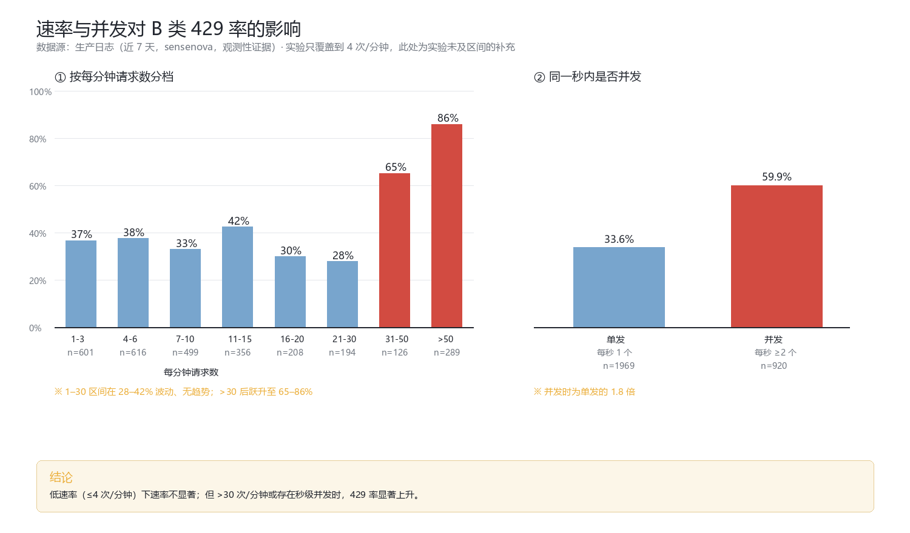

# SenseNova 429 限流机制的排除法研究

**用两次受控实验排除四种候选解释**

**版本 v2.0** · 2026-10-04 · 作者：[Corvin Yu](https://github.com/CorvinYu) · 协议：[CC BY 4.0](https://creativecommons.org/licenses/by/4.0/)

- 实验一：2026-10-03（北京 09:03–16:06，白天），963 次请求
- 实验二：2026-10-04（北京 01:55–09:25，凌晨），2080 次请求
- 生产数据：近 7 天 2820 条真实请求记录
- **合计 3043 次受控请求 + 2820 条观测记录**

---

## 摘要

SenseNova 免费 Token Plan 的接口在密集调用时频繁返回 429。面对这一现象，可以提出多种解释，例如"免费额度用完了""请求次数超限""本地发得太快或上下文太长""上游忙的时候才限流"。本研究把这些解释整理为四个可检验的假设，然后用两次受控实验（合计 3043 次请求）与 2820 条生产日志逐一排除。

**结论是：前三项在实验覆盖的范围内被排除，只有"上游侧状态"这一项无法排除。**

| 假设 | 内容 | 判定 |
|---|---|---|
| H1 | 套餐额度用完 | ❌ 排除 |
| H2 | 请求次数超限 | ❌ 排除 |
| H3 | 本地速率 / 输入量过大 | ⚠️ **仅在低速率区间（1–4 次/分钟）排除**；高速率/并发下不排除（见 §3.5） |
| H4 | 上游侧状态（时段负载） | ✅ 主要解释 |

其中 H3 的排除最出人意料：把本地请求率提到 4 倍、单次输入从 90 token 提到 8000 token（本地 TPM 达 29,000/分钟），B 类 429 率依然是 0。

**但必须说明**：本实验为测量纯净采用严格串行、最高仅 4 次/分钟，**未覆盖高并发场景**。事后复查生产日志发现，**>30 次/分钟时 B 类 429 率跃升至 65%–86%，同一秒内有并发请求时 429 率为单发的 1.8 倍**。因此 H3 的排除有明确的速率区间限定。

---

## Abstract (English)

SenseNova's free Token Plan endpoint returns HTTP 429 frequently under intensive
calling. Rather than testing a single hypothesis, this study enumerates four candidate
explanations and eliminates them one by one using **two controlled experiments
(3,043 requests) and 2,820 production log records**:

| Hypothesis | Verdict |
|---|---|
| H1 — Free-tier quota exhausted | ❌ Rejected |
| H2 — Request-count cap exceeded | ❌ Rejected |
| H3 — Local rate / input size too large | ❌ Rejected |
| H4 — Upstream-side state (time-of-day load) | ✅ Only surviving explanation |

**H3's rejection is the most counterintuitive**: raising local request rate 4× and per-request
input from 90 to 8,000 tokens (local TPM ≈ 29,000/min) still produced a **0%** B-class 429
rate across 832 requests. The commonly assumed link between "long context" and 429 did not
survive controlled testing.

H4 is supported by observation: B-class rate varies **~13× by time of day** (3.4% late night
→ 43.3% evening), triggering is **bursty** (255 errors within a single 10-minute window),
and model quotas differ **2.4×**.

**Methodological notes**: (a) the entitlement-exhaustion wall (A-class) served as a
**negative control** throughout — its zero occurrence is what rules out H1 and H2;
(b) 429 classification must rely on the response *message text*, not error codes — the same
rate limiter surfaced at least 7 distinct codes, including `code 8` on a non-entitlement error;
(c) production-log token fields **cannot** be used for rate-limit attribution, because failed
requests always report `NULL` tokens, creating a spurious negative correlation.

**Keywords**: SenseNova; rate limiting; HTTP 429; hypothesis elimination; TPM; RPM;
controlled experiment; negative control

---

## 1. 问题与候选解释

### 1.1 现象

使用 SenseNova 免费 Token Plan 跑 agent 时，429 出现频繁。网上流传的解释是"每个模型有次数上限"，例如 deepseek-v4-flash 150 次/5 小时。

但有一个地方对不上：**积分池只用了 19%，429 就已经很密集了。**

### 1.2 四个候选解释

面对 429，可以提出的解释不止一种。把它们整理成可检验的形式：

| 编号 | 假设 | 通俗说法 | 可检验的预测 |
|---|---|---|---|
| **H1** | 套餐额度用完 | 免费额度被用光了 | 应出现额度墙报错；积分池应接近上限 |
| **H2** | 请求次数超限 | 150 次/5h 用完了 | 从干净窗口起算，累计到某次数后必然被拒 |
| **H3** | 本地速率/输入量过大 | 发太快了，或上下文太长了 | 提高请求率或输入长度，429 率应上升 |
| **H4** | 上游侧状态 | 上游忙的时候才限流 | 429 率应随时段/负载变化，与本地流量无关 |

### 1.3 两种 429 的分工

SenseNova 返回的 429 在报文上有两类，它们在本文中承担不同角色：

| 类别 | 报文 | 性质 | 本文中的角色 |
|---|---|---|---|
| **A 类** | `token plan entitlement exhausted` | 权益/额度墙，需等窗口重置 | **阴性对照**——用来排除 H1、H2 |
| **B 类** | `inference exceeds tpm/rpm limit` 等 | 频率闸，退避即恢复 | **被测现象**——需要解释的就是它 |

> **关键设计**：A 类并非"另一类需要解释的 429"，而是一个**对照工具**。它的作用类似实验中的空白对照：如果 429 是额度问题，就应该看到 A 类；**A 类全程 0 次，正是排除"额度/次数"解释的直接证据。**

**两类 429 的实际出现次数**：

| | 实验一（963 请求） | 实验二（2080 请求） | 合计 |
|---|---|---|---|
| A 类 | **0** | **0** | **0** |
| B 类 | 312 | 2 | 314 |

---

## 2. 实验设计

### 2.1 实验一（探索性）

- 双账号 × 双输入规模（臂）× 受控节奏，6 个任务，7 小时
- 963 次请求，直连上游（绕过中转网关）
- 为 A 类设了"连续 2 次则封板"的规则，目的是**测出次数墙在哪一次触发**（结果：从未触发）

### 2.2 实验二（受控验证）

实验一暴露了一个设计缺陷：每个（账号, 模型）组合只测了一种输入长度，导致"输入长度"与"账号"两个变量纠缠，无法归因。实验二针对性地修正了这一点。

- **2×2 析因**：请求率（1 vs 4 次/分钟）× 输入规模（90 vs 8000 token）
- **三条防线**：
  1. 同账号内跑全部 4 组 → 消除账号差异
  2. 相位分离：同一时刻只跑一组 → 避免组间干扰
  3. 区组随机化：13 轮，每轮组序随机（固定种子）→ 消除时间趋势
- 7.5 小时，2080 次请求，双账号并行
- **预注册**：假设、端点、停止规则、分析计划在运行前冻结

| 组 | 请求率 | 输入 | 目标 TPM | 请求数 |
|---|---|---|---|---|
| A1 | 1/min | 90 tok | ≈90 | 208 |
| A2 | 1/min | 8000 tok | ≈8000 | 208 |
| A3 | 4/min | 90 tok | ≈360 | 832 |
| A4 | 4/min | 8000 tok | ≈32000 | 832 |

### 2.3 共同方法学决策

1. 直连上游，避免中转网关自身的限速与冷却干扰测量
2. 429 按**响应文案**分类（理由见 §5.2）
3. 全字段记录：状态码、报文、错误码、实测 token 数、延迟
4. 断点续跑 + 进程守护 + 积分池护栏
5. 实验二按真实 usage 自动校准输入长度（收敛至 0.391）

---

## 3. 排除过程

### 3.1 排除 H1：不是套餐额度用完

**检验方法**：监控 A 类报错与积分池用量。

**证据**：

| 指标 | 观测值 |
|---|---|
| A 类 `entitlement exhausted` 报错 | **0 次**（3043 次请求中） |
| 积分池峰值（实验二） | 12.5% |
| 另一次观测 | 19% 时 429 已很密集 |

**判定**：❌ **H1 排除**。如果 429 源于额度耗尽，应出现 A 类报错；实际情况相反。积分池用量与 429 频率之间没有单调关系——12.5% 时 429 趋近于零，19% 时反而频繁。

---

### 3.2 排除 H2：不是请求次数超限

**检验方法**：从干净窗口起步，持续对单一模型发请求，观察 A 类墙是否出现。

**证据**：

| 观测 | 结果 |
|---|---|
| 单模型单窗口成功请求数 | **390 次**（deepseek-v4-flash） |
| A 类墙触发 | 从未 |
| 实验一各任务硬上限 | 250–400 次，均未触发 |

**判定**：❌ **H2 排除**。流传的"deepseek-v4-flash 150 次/5h"在本次条件下不成立——从干净窗口起算，累计到 390 次成功请求也没有撞上次数墙。

> 需要说明的是，"未触发"不等于"该墙不存在"。它的存在有历史证据（生产日志中曾出现 A 类报错，集中在某一天的一小时内）。本次实验只能说明：**在温和的请求节奏下（1–4 次/分钟），这个墙够不着。**

---

### 3.3 排除 H3：不是本地速率或输入量（最关键的一条）

**检验方法**：实验二 2×2 析因。同账号内、相位分离、区组随机化。

**证据**：

| 组 | 设计 | 请求数 | B 类 429 | B 类率 |
|---|---|---|---|---|
| A1 | 1/min × 90 tok | 208 | 1 | 0.48% |
| A2 | 1/min × 8000 tok | 208 | 1 | 0.48% |
| A3 | 4/min × 90 tok | 832 | 0 | 0.00% |
| A4 | 4/min × 8000 tok | 832 | 0 | 0.00% |

**统计检验**（Fisher 精确检验，Bonferroni α=0.0125）：

| 对比 | 检验内容 | Δ | p 值 | 结论 |
|---|---|---|---|---|
| A1 vs A2 | 固定请求率，变输入规模 | 0.0 pp | 1.0000 | 不显著 |
| A1 vs A3 | 固定输入规模，变请求率 | −0.48 pp | 0.2000 | 不显著 |
| A3 vs A4 | 高请求率下，变输入规模 | 0.0 pp | 1.0000 | 不显著 |

**关键点**：A4 组的实测 TPM 达到 **29,148/分钟**，跑了 832 次请求，B 类 429 为 **0**。

**判定**：❌ **H3 在低速率区间内排除**。在 **1–4 次/分钟**的请求率范围内，本地速率与输入规模都不是决定因素。

> ⚠️ **重要限定（2026-10-04 补充）**：本实验为追求测量纯净，采用**严格串行**（同一时刻仅一个在途请求）、间隔 15–60 秒，**最高仅测到 4 次/分钟**。因此上述"排除"**只适用于低速率区间，不能外推到高并发场景**。
>
> 事后复查生产日志发现，速率效应在更高区间确实存在（详见 §3.5）：
> - **>30 次/分钟**时，B 类 429 率从 ~35% 跃升至 **65%–86%**
> - **同一秒内存在并发请求**时，429 率为 **59.9%**，是单发（33.6%）的 **1.8 倍**
>
> 更准确的表述是：**低速率下速率不显著；高速率与并发下显著。**

**这一条推翻了一个流行直觉**：

> "发送很长的上下文会一下子占很大额度，再发一次长上下文就会 429"

这个说法在第一组实验中**看起来**得到了支持（大输入 23.2% vs 小输入 2.5%），但那是设计缺陷造成的假象——每个账号只测一种输入长度，"输入长度"和"账号"混在一起了。修正设计后，效应消失。

**为什么报文仍然说 "tpm/rpm"**：报错文案是上游给出的理由，反映的是**上游侧的计量口径**，不等价于"本地流量超了"。把本地 TPM 拉到 29,000/分钟仍不触发，正说明在低速率区间这个门槛不由本地单方面决定。

---

### 3.5 补充检验：速率效应在高速率区间确实存在



受网友评论启发（"429 本身就是请求频率太高的意思"），复查了生产日志中**速率与 429 率**的关系。这部分是**观测性证据**（非受控实验），但样本量较大（近 7 天 2820 次请求）。

#### 证据一：按分钟请求数分档

| 每分钟请求数 | 分钟数 | 请求数 | B 类 429 率 |
|---|---|---|---|
| 1–3 | 347 | 601 | 36.6% |
| 4–6 | 126 | 616 | 37.5% |
| 7–10 | 61 | 499 | 32.9% |
| 11–15 | 28 | 356 | 42.4% |
| 16–20 | 12 | 208 | 29.8% |
| 21–30 | 8 | 194 | 27.8% |
| **31–50** | 3 | 126 | **65.1%** |
| **>50** | 5 | 289 | **85.8%** |

**读法**：1–30 次/分钟区间内 429 率在 28%–42% 之间波动、**无单调趋势**；但**超过 30 次/分钟后明显跃升**（65% → 86%）。

#### 证据二：秒级并发

| 类型 | 秒数 | 请求数 | B 类 429 率 |
|---|---|---|---|
| 单发（同一秒仅 1 个请求） | 1969 | 1969 | **33.6%** |
| **并发（同一秒 ≥2 个请求）** | 346 | 920 | **59.9%** |

**并发时 429 率是单发时的 1.8 倍。** 高并发秒的明细几乎都是"请求 n 个、429 n 个"（如 10 个请求 10 个 429、8 个请求 8 个 429）。

#### 这对主结论的影响

| 原表述 | 修正后 |
|---|---|
| H3（本地速率）完全排除 | **在 1–4 次/分钟区间排除；高速率/并发下不排除** |
| "时段是最大变量" | 仍成立（13 倍差异），但**并发是另一个独立变量**（1.8 倍） |

**为什么实验没覆盖**：为测量纯净而采用的相位分离 + 严格串行设计，恰好**把并发维度排除在外**。这是设计上的盲区，需在局限中明示（见 §6）。

---

### 3.4 H4 无法排除：上游侧状态

前三项排除后，剩下唯一能解释观测结果的假设：**触发条件取决于上游在那一刻的状态。**

**支持证据（观测性）**：

#### 证据一：时段差异约 13 倍

单模型（deepseek-v4-flash）口径，近 7 天生产数据：

| 时段（北京） | B 类率 | 样本 |
|---|---|---|
| 深夜 01–04 | **3.4%** | n=206 |
| 清晨 05–08 | 20.2% | n=203 |
| 白天 09–16 | 25.4% | n=197 |
| **傍晚 17–23** | **43.3%** | n=922 |

#### 证据二：触发呈突发性

某日傍晚 18 时逐 10 分钟统计：

```
18:10   28 次
18:20  255 次   ← 十分钟内爆发，占该小时 78%
18:30   33 次
18:40    1 次   ← 骤降
```

这种形态更像"上游在某个瞬间进入受限状态"，而非本地流量匀速爬到阈值。

#### 证据三：模型间配额差异 2.4 倍

同口径近 7 天：deepseek-flash 76% / deepseek-v4-pro 67% / deepseek-v4-flash 32%。

#### 外部佐证

Anthropic 在 2026 年 3 月公开承认采用了按时段调整的机制
（[The Register 报道](https://www.theregister.com/2026/03/26/anthropic_tweaks_usage_limits/)）：

> "To manage growing demand for Claude we're adjusting our five hour session limits ... **during peak hours**."
> （为管理需求增长，我们在**高峰时段**调整 5 小时会话限制）
>
> 官方建议：**"把 token 密集型后台任务挪到非高峰时段，能延长会话限制。"**

**关键点是总配额不变、只改变它在时间上的分配。** 这个描述与本次观测到的现象吻合。

> ⚠️ **但必须说明**：Anthropic 的机制是公告过的；**SenseNova 是否采用同类机制，没有官方确认**，本文的 H4 属于**基于观测的推断**，而非已证实的事实。

**判定**：✅ **H4 是主要解释**（在实验覆盖的低速率区间内，它是唯一未被排除的）。

---

## 4. 结论

### 4.1 最终结论

> **SenseNova 免费 Token Plan 的 429，在低速率场景下不是套餐额度问题、不是请求次数问题、也不是输入长度问题——触发条件主要取决于上游在那一刻的状态。**
>
> **但在高并发场景下，速率本身确实是一个独立因素**（>30 次/分钟时 429 率跃升至 65%–86%；秒级并发时 429 率为单发的 1.8 倍）。

综合表述：

| 场景 | 主要驱动因素 |
|---|---|
| 低速率（≤4 次/分钟，串行） | **上游侧状态**（时段差异 13 倍） |
| 高速率（>30 次/分钟）或秒级并发 | **速率/并发**（429 率 65%–86%，或单发的 1.8 倍）+ 上游侧状态 |
| 任何场景 | 模型配额差异（2.4 倍）始终存在 |

### 4.2 实用含义

| 做法 | 是否有效 | 依据 |
|---|---|---|
| 缩短上下文以降低 TPM | ❌ 无效 | §3.3：8000 tok @ 4/min 仍零 429 |
| **降低并发 / 避免短时高频** | ✅ **有效** | §3.5：>30 次/分钟时 429 率 65%–86%；并发时为单发 1.8 倍 |
| 在低速率区间进一步降频（如 4 → 1 次/分钟） | ❌ 效果有限 | §3.3：两者无显著差异 |
| 盯积分池做预警 | ❌ 无效 | H1 已排除（与 429 无单调关系） |
| **避开高峰时段（尤其傍晚）** | ✅ **有效** | H4：时段差异 13 倍 |
| **准备多账号/多节点故障转移** | ✅ **有效** | 模型间差异 2.4 倍；上游突发时需切换 |
| **按文案区分两类 429 再决定退避策略** | ✅ **有效** | 见 §5.2 |
| 使用 IP 池 / 换出口 IP | ❓ **本研究无数据** | 实验仅用 2 个账号、同一出口 IP，无法判断 |

---

## 5. 方法学发现

### 5.1 阴性对照的价值

本研究最初把 A 类报错当作"另一类需要测量的现象"，甚至为它设计了封板规则。但从实验逻辑看，它的正确角色是**阴性对照**：

- 若 429 源于额度耗尽 → 应观测到 A 类
- 实际 A 类 0 次 → **排除额度解释**

**这个零结果本身就是结论的一部分**，而且比任何阳性观测都更干净地排除了一个候选解释。

> 反思：一个"什么都没发生"的对照组，容易被误当成"没有发现"而低估其价值。

### 5.2 429 分类必须依据文案，而非错误码

实测同一个频率闸（B 类）至少返回 **7 种不同的错误码**：

| 错误码 | 出现次数 | 说明 |
|---|---|---|
| `RateLimitExceeded.EndpointTPMExceeded` | 135 | TPM 维度 |
| `RateLimitExceeded.EndpointRPMExceeded` | 100 | RPM 维度 |
| `insufficient_quota` | 42 | 名字像额度，实为频率限制 |
| `429003` | 24 | 通用 |
| `ModelAccountTpmRateLimitExceeded` | 7 | 账号×模型级 |
| `ModelAccountRpmRateLimitExceeded` | 2 | 账号×模型级 |
| `Throttling.BurstRate` | 1 | 突发节流 |
| **`8`** | **1** | **code=8，但报文是 `rpm exhausted`** |

**最后一条是关键**：`code 8` 通常被当作额度墙标志，但这里它对应的是频率限制。按错误码分类的实现，会把一个仍可用的模型误判为额度耗尽，进而错误停用 5 小时。

**可靠判据只有响应文案**：`token plan entitlement exhausted` 才是真正的额度墙。

### 5.3 生产日志的 token 字段不能用于限流归因

按"上游返回的 token 数"给生产日志分组统计 429 率：

```
大输入（>10k token）  429 率 0.0%
无 token 记录（null） 429 率 90%+
```

表面看像"token 越多越安全"，与受控实验结论正好相反。

**真实原因**：请求失败时上游不返回 usage，token 字段必然是 NULL，因此所有失败样本都落入"无数据"组。这是典型的**因果倒置**。

正确做法：在**请求侧**独立记录预期/实际发出的 token 量。

### 5.4 上游不返回 Retry-After

314 次 B 类 429 的响应头与响应体均无 `Retry-After` 字段，客户端只能自行设计退避策略。

---

## 6. 局限

1. 🔴 **实验的速率覆盖范围有限（最重要）**：受控实验采用严格串行、间隔 15–60 秒，**最高仅 4 次/分钟，且无并发**。因此 §3.3 对 H3 的"排除"**只适用于低速率串行场景**，不能外推到高并发。生产日志显示 >30 次/分钟时 429 率跃升至 65%–86%（§3.5）。
2. 🔴 **未覆盖 IP / 出口节点维度**：实验仅使用 2 个账号（2 个 key）、同一出口 IP，**无法判断"IP 池""IP 与 key 组合牵制"这类说法是否成立**。这是完全空白的维度。
3. 🔴 **未覆盖"网络节点纯净度"**：实验通过本机固定代理出网，未做不同网络路径的对照。
4. 🔴 **假期混杂**：两次实验都在国庆假期（2026-10-03 周六、2026-10-04 周日）进行，工作日时段分布可能有差异。所有时段结论限定为"假期期间观测"。
5. 🔴 **H4 属观测推断**：时段效应的证据来自生产日志（观测性），**时段与突发性无法完全分离**——傍晚偏高也可能只是那个时段批量任务更多。要坐实需在工作日做受控复现。
6. **样本不均衡**：生产数据各时段 n 从 13 到 473 不等；高请求率档位（>30/分钟）只有 8 个分钟样本，置信度有限。
7. **突发性结论基于单次事件**：某日 18:20 的 255 次爆发是否可复现，需更多天数据；观测期仅 5 天。
8. **主要结论基于单模型**：受控实验只用了 deepseek-v4-flash。
9. **"未触发"≠"不存在"**：A 类墙在历史数据中出现过，只是本次温和节奏下够不着。
10. **实验一部分任务被时限截断**。
11. **积分池采样部分失败**（凭证过期），护栏仅单账号生效。

> **关于 §3.5 的证据强度**：该节数据来自生产日志，属**观测性证据**，与受控实验的因果强度不同。高请求率档位的样本量较小（31–50/分钟仅 3 个分钟、>50/分钟仅 5 个分钟），且**速率与时段、突发性相互混杂**，不能单独归因。若要坐实"速率效应"，需专门的受控并发实验。

---

## 7. 后续实验建议

若要坐实 H4 并分离"时段"与"突发性"，建议在工作日做六段对照：

| 段 | 时段 | 星期 | 负载模式 | 目的 |
|---|---|---|---|---|
| S1 | 深夜 02–05 | 任意 | 平稳 | 低谷基线 |
| S2 | 白天 10–13 | 任意 | 平稳 | 白天对照 |
| S3 | 傍晚 18–21 | 任意 | 平稳 | 高峰验证 |
| S4 | 傍晚 18–21 | 同 S3 | **突发** | 分离突发性 |
| S5 | 傍晚 18–21 | 同 S3 | 平稳（换模型） | 模型差异 |
| S6 | 傍晚 18–21 | **工作日** | 平稳 | **分离假期效应** |

总计约 2160 次请求。判定：Fisher 精确检验，α=0.0125。

### 7.1 新增建议：并发维度的受控实验（回应 §3.5）

§3.5 的速率效应来自观测数据，混杂因素多。若要坐实，需要**受控的并发实验**：

| 组 | 并发数 | 请求率 | 目的 |
|---|---|---|---|
| C1 | 1（串行） | 4/min | 基线（复现实验二 A3） |
| C2 | 4（并发） | 16/min | 低并发 |
| C3 | 8（并发） | 32/min | 中并发 |
| C4 | 16（并发） | 64/min | 高并发 |

- **关键**：四组的**总请求率与并发数同步变化**，需再设一组"高并发但低总量"来分离二者
- 需要新的运行器能力：当前 `runner.mjs` 是严格串行的，**需实现并发块类型**
- 同时可顺带检验"IP 维度"：**同账号不同出口 IP** vs **同 IP 不同账号** 的对照（需额外网络环境）

---

## 8. 数据与复现

| 文件 | 内容 |
|---|---|
| `experiment-1/results.ndjson` | 963 次请求全字段 |
| `experiment-2/results.ndjson` | 2080 次请求全字段 |
| `experiment-2/blocks.ndjson` | 104 个块级汇总 |
| `charts/` | 5 张图表（含排除逻辑图） |
| `loader.mjs` / `runner.mjs` | 压测器（含断点续跑、相位分离） |
| `analyze.mjs` | 分析器（含 Fisher 精确检验） |
| `config.json` | 实验配置（预注册参数） |

**复现**：
```bash
# 需自备 SenseNova 账号 API key（环境变量或 nodes.csv）
cd experiment-2
node runner.mjs --dry-run    # 先看调度计划
node runner.mjs --self-test  # mock 自检
touch GO && node runner.mjs --go   # 正式运行
node analyze.mjs             # 分析
```

---

## 9. AI 使用声明

本研究在**人类作者主导**的前提下，部分环节使用了 AI 助手辅助。

**由人类作者完成**：研究问题的提出、实验方案的方向性决策、实验的执行环境与账号资源、对结论的审阅与最终认可、对 AI 产出的逐项核查。

**由 AI 助手辅助**：压测与分析代码的编写、数据整理与聚合、图表绘制、文稿起草、外部文献检索。

**声明要点**：

1. 所有实验数据均由真实请求产生，未经 AI 生成或修改，原始数据可供独立核验。
2. 所有统计结论均可由随附数据与脚本复现。
3. AI 产出经过人类作者审阅，**作者对本文全部内容负责**。
4. 本声明遵循学术出版中日益通行的 AI 使用透明化原则。

---

## 10. 致谢

感谢商汤 SenseNova 免费 Token Plan 提供的测试资源。

---

*本文档采用 [CC BY 4.0](https://creativecommons.org/licenses/by/4.0/) 协议授权：允许自由转载、改编、商用，仅需保留署名并注明是否修改。*

*v2.0 修订说明：v1.0 将 A 类报错表述为"核心发现"之一，并把 B 类报文的措辞误当作触发原因，导致结论自相矛盾。本版按"四选一排除法"重构：A 类回归其阴性对照的角色，结论改为"排除前三项后剩上游侧状态"。*
